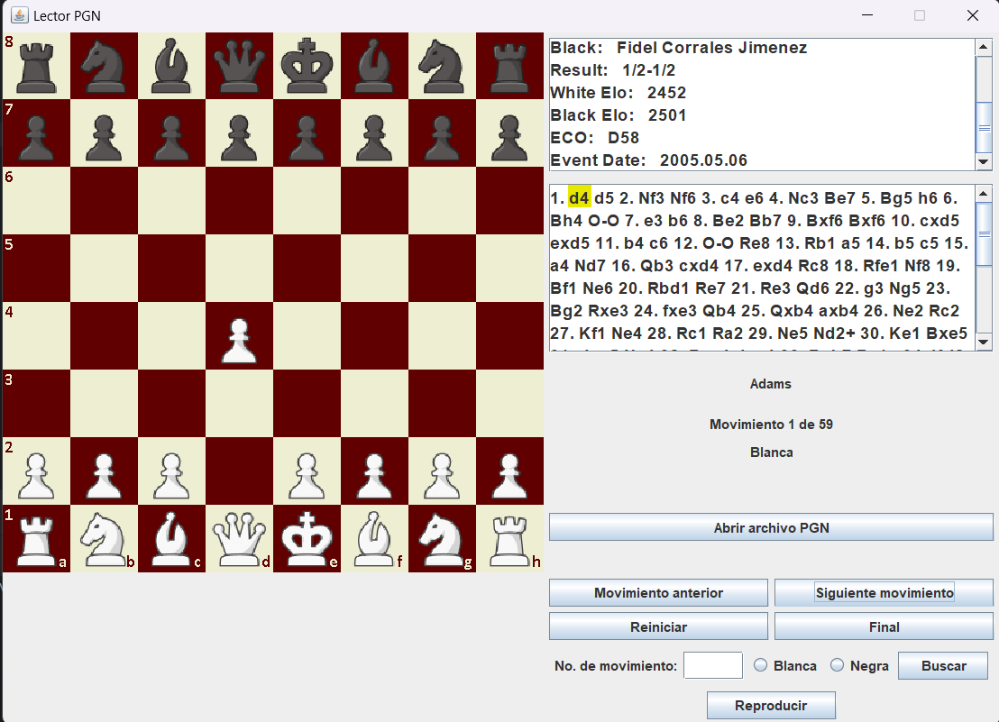

# Lector de Partidas de Ajedrez.

Visor de partidas de ajedrez que permite cargar y visualizar partidas en formato PGN (Portable Game Notation). Implementado en Java utilizando Swing para la interfaz gráfica.



## 🚀 Características

- Visualización de tablero de ajedrez interactivo
- Carga de archivos PGN
- Navegación por movimientos
- Información detallada de la partida (ELO, jugadores, fecha)
- Reproducción automática de partidas

## 📋 Requisitos Previos

- Java JDK 8 o superior
- IDE Java (opcional)

## ⚡ Ejecución

### Desde un IDE

1. Abre el proyecto en tu IDE favorito
2. Localiza la clase `Main.java`
3. Ejecuta la clase Main

### Desde la línea de comandos

1. Compila el proyecto:
```bash
javac Main.java controller/Controller.java view/View.java
```

2. Ejecuta la aplicación:
```bash
java Main
```

## 💻 Código Principal

```java
import controller.Controller;
import view.View;

import javax.swing.*;

public class Main {
    public static void main(String[] args) {
        SwingUtilities.invokeLater(() -> {
            try {
                View view = new View();
                Controller controller = new Controller(view);
            } catch (Exception e) {
                e.printStackTrace();
                JOptionPane.showMessageDialog(null, "Error al iniciar la aplicación: " + e.getMessage());
            }
        });
    }
}
```

## 🎮 Uso

1. Inicia la aplicación
2. Utiliza el botón "Abrir archivo PGN" para cargar una partida. Puedes usar el archivo de muestra que se encuentra en el repositorio.
3. Navega por la partida usando los controles:
   - Movimiento anterior
   - Siguiente movimiento
   - Reiniciar
   - Final
   - Reproducir

## ⚙️ Funcionalidades

- **Visualización del Tablero**: Representación gráfica completa del tablero
- **Información de Partida**: Muestra datos como ELO, jugadores y fecha
- **Navegación**: Controles intuitivos para moverse por la partida
- **Búsqueda**: Permite buscar movimientos específicos
- **Reproducción Automática**: Opción para reproducir la partida automáticamente

## 🔍 Solución de Problemas

Si encuentras el error "Error al iniciar la aplicación":

1. Verifica que tienes Java 8 o superior instalado
2. Comprueba que la estructura de carpetas es correcta
3. Asegúrate de que tienes permisos de lectura/escritura
4. Verifica que el archivo PGN es válido

## ✨ Por Implementar

- [ ] Sonidos.
- [ ] Temas visuales personalizables
